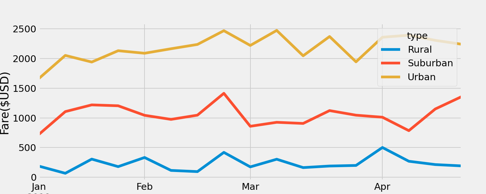

# PyBer_Analysis
## Overview
The purpose of the analysis for PyBer was to manipulate and visualize the ride data for different cities and make observations. An area of interest for this analysis was to get a high level look at the average data for city types of three catagories: Rural, Suburban, and Urban. The first step of the analysis was to create a dataframe that contains the following values for each city type: the total rides, drivers and fares, and average fare per ride and per driver. The second part of the analysis was to create a line graph with multiple lines to represent the total fares each city type incurred each week over the course of several months.

## Results
### Summary DF:
The following image shows a screenshot from the PyBer_challenge jupyter notebook that contains the summary dataframe for each city type. The most aparrent trend in this table is that the area with the least amount of drivers (least populated) has higher averages fares. It would appear that each driver is making more per trip in rural and suburban areas, and it is cheaper for someone to catch a ride in an urban area. A limitation to this high fare rate, is that we do not include the distance for the drives, and it could be the total distance of the drive that is increasing the fare, not just supply and demand showing up in the fewer number of drivers. The other observation here is that there are significantly fewer rides in rural areas versus suburban areas and the total fares collected in urban areas is significantly higher.

### Line Chart:

The graph below shows the total fares collected each week in each city type over a period of several months:

Here we see that urban cities are bringing in a lot more revenue that suburban and urban cities, however if we remember the summary dataframe, there are many more total rides in these cities. Additionally, we can see that there seems to be an upward trend in total fares from january to april for the urban and suburban cities, while the rural fares do not seem to be trending upward. there is a shared peak in the third week of february for all three city types. 

## Summary and Recommendations
We recommend for PyBer to publish a portion of this data to rural areas, showing a good average fare per driver stat, to incentivize more drivers to sign up for these areas, which would in turn might bring the average fare down for the customers as scarcity of drivers decreases. Additionally we recommend further investigation into the spike in fares for the end of February. Finally, we recommend targeting marketing to the suburban areas, as fares appear to be increasing into May, and it appears that more drivers may be needed. The number of rides per drivers is 1.27 for suburban areas and 0.67 for urban areas, so to get the suburban area total fares to reflect more similarly to the urban line, we need more drivers to make it more convenient to find a ride.